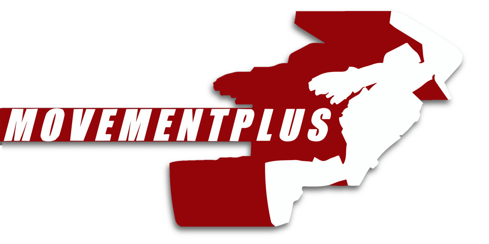

MovementPlus revamps and introduces multiple new movement mechanics to allow for faster, more rewarding gameplay.

Many of the features included can be tweaked or outright disabled via the config file.

### TRAILER GOES HERE

## New Features

- Frameboost
- Super trick jump
- Perfect manual
- Fast fall
- Rail goon

## Adjusted Vanilla Features

- Improved carpet sliding
- Vert ramps scale with speed
- Increased max fall speed
- Reduced ground trick deceleration
- Removed rail deceleration
- Air dash retains more speed when changing directions
- Rail hard corners give less speed per, but peak at a higher speed
- boost scales with your total speed

 
For more in-depth explanations of the new and adjusted features visit THIS-LINK to learn more.

 ## Instalation

 - Ensure you have BepInEx 5.4.21 installed, if you do not have that installed you can find it [here](https://github.com/BepInEx/BepInEx/releases/tag/v5.4.21)
 - Navigate to the Bomb Rush Cyberfunk folder, if you have the steam version this is located at this path "Program Files\Steam\steamapps\common\BombRushCyberfunk"
 - Place the MovementPlus.dll into the \BepInEx\plugins folder, if you have BepInEx installed correctly this folder should already exist
 - Launch the game

 - Alternitivly you can use r2modman and let is handle that entire process, it can be found [here](https://thunderstore.io/c/bomb-rush-cyberfunk/p/ebkr/r2modman/)

 ## Credits
 Make sure to thank _the boys_ for all their work.
